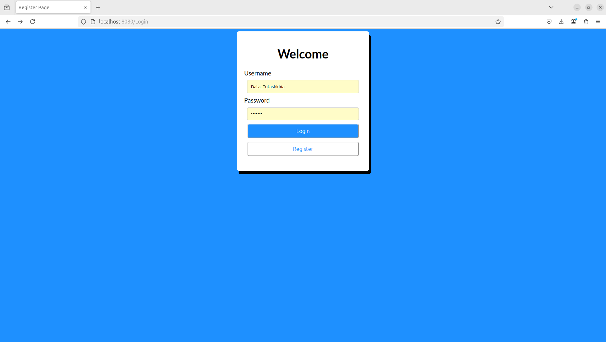
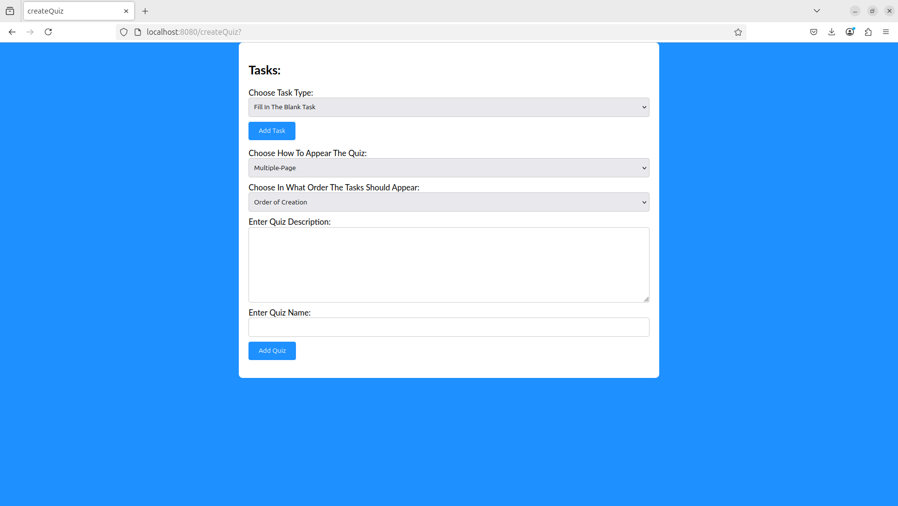
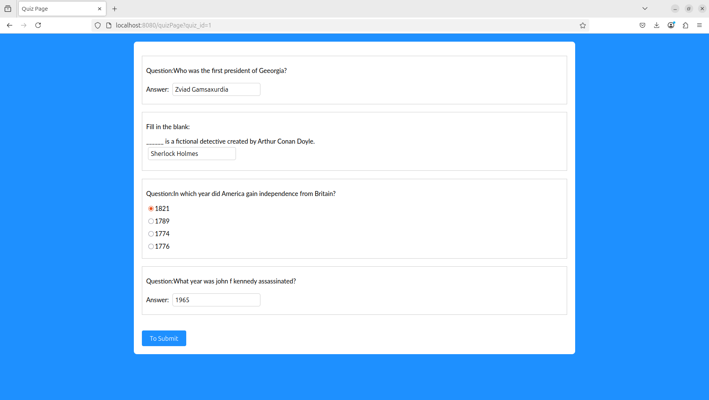
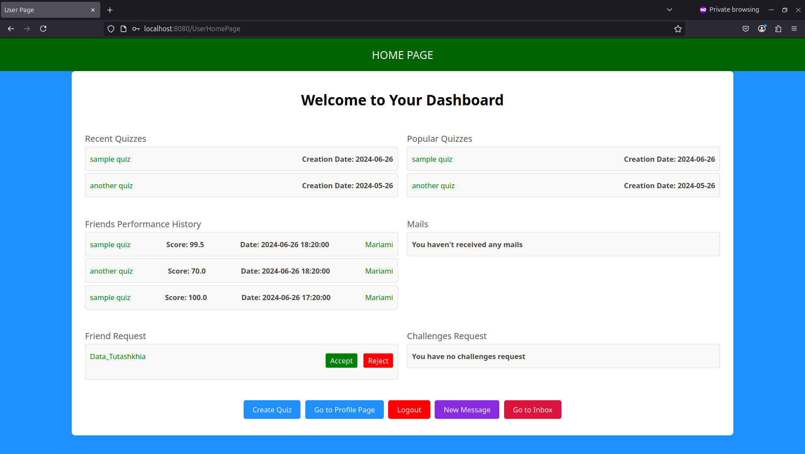
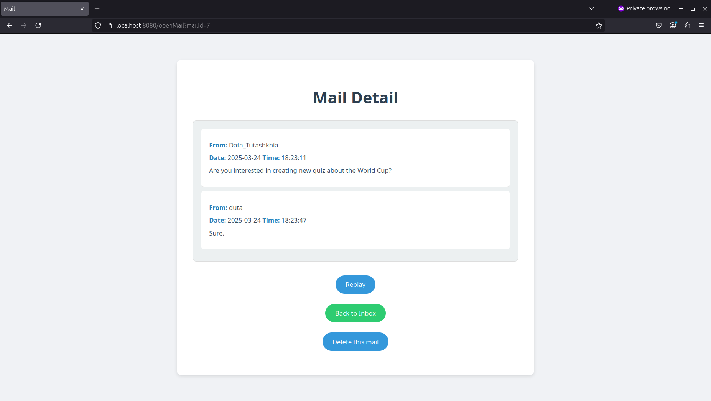
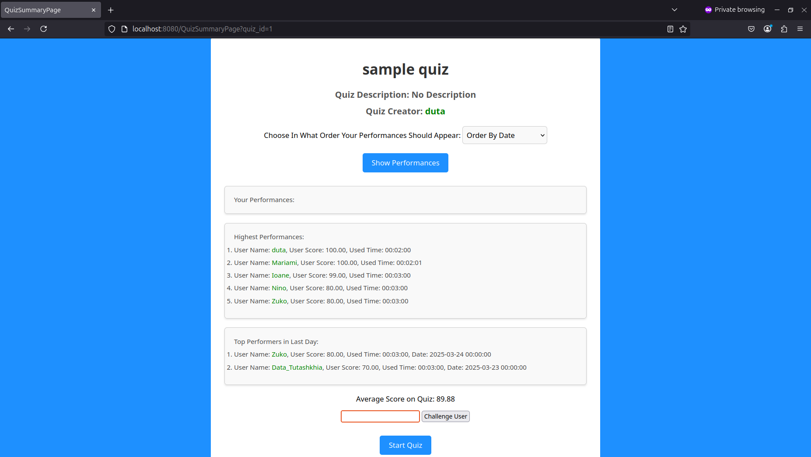
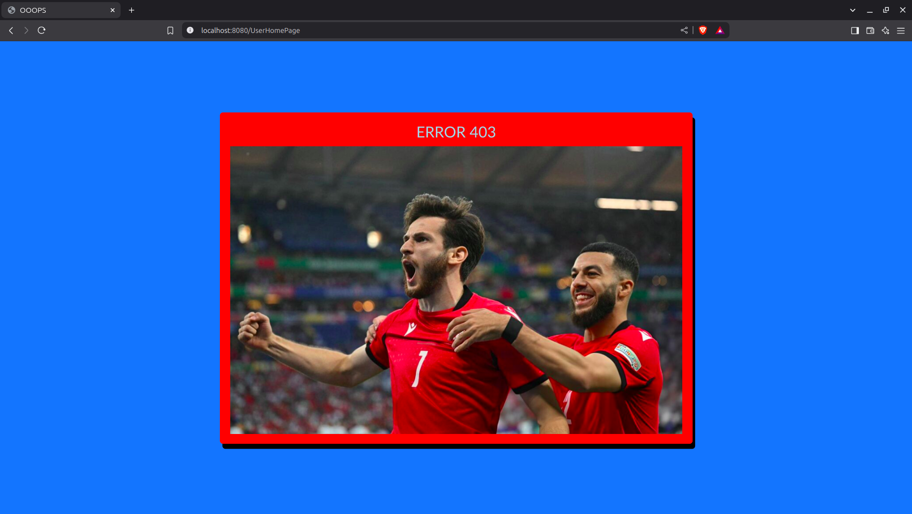

# QuizWebsite Application 📝🌐

Welcome to the **QuizWebsite** application! This is a simple and interactive quiz platform built using **Java** and **Maven**. It is part of the **Object-Oriented Programming (OOP)** course project (final project). The application allows users to take quizzes, answer questions, and view their results.

The backend is powered by **Java**, and **Maven** is used for dependency management and build automation. Additionally, the application uses **Servlets** to provide a **RESTful API** for managing quizzes, questions, and user interactions.

## Features 🚀

- **User Authentication** 🔑: Users can register and log in to the application to access all features.

- **Quiz Management** 📋:
   - **Create and Participate**: Anyone can create a quiz and participate in any available quiz.
   - **Quiz Types** ❓: The application supports various quiz types, including:
      - **Fill in the Blank** ✍️
      - **Multiple Choice** ✅
      - **Question Response** 📝
      - **Picture Response** 🖼️

- **Quiz Configuration** ⚙️:
   - The order of the questions can be **fixed** or **randomized** 🔀.
   - Quizzes can be presented on **multiple pages** or as a **single page** 📄.

- **Results Tracking** 📊:
   - Users can view general results for specific quizzes.
   - Users can track their quiz history as well as their friends' quiz history (both overall and for specific quizzes).

- **Friends & Social Features** 👥:
   - Users can see other people's quiz history and add them as friends.
   - Users can send and receive **friend requests** to connect with others.
   - Users can challenge friends to take specific quizzes.

- **Messaging** 📧:
   - Users can **send** and **receive messages** from their friends.
   - Users can view their **inbox history**.

- **Leaderboard** 🏆:
   - Users can see the **top scorers** and **rankings** based on quiz results.
   - The leaderboard displays the highest-performing users for individual quizzes.

- **Error Handling** ⚠️:
    - The application includes error codes for common issues such as accessing forbidden pages or incorrect routes.
    - Users may see specific error messages related to page access issues.

- **Caching** 💾:
    - The application utilizes caching to store user sessions. If a user is signed in, they will remain signed in across multiple sessions until they log out.

## Technologies Used 🛠️

- **Java** ☕: The core programming language used to build the application.
- **Maven** ⚙️: Used for dependency management and project build automation.
- **Servlets** 🌐: Used to implement a **RESTful API** for handling HTTP requests and responses.
- **JSP (JavaServer Pages)** 🖥️: Used for rendering dynamic web pages and views on the frontend.
- **AJAX** 🔄: Used for making asynchronous requests to the server without reloading the page, enhancing user experience.
- **Sockets** 🔌: Used for real-time communication, enabling features like live messaging and challenging friends.
- **MySQL** 🗄️: Database for storing user data, quiz information, and results.
- **CSS3** 🎨: Used for styling the frontend and making the application responsive.
- **JavaScript** 📜: For client-side functionality and interactive features.


## Installation 🚀

To get started with the **QuizWebsite** application, follow these steps:

### Prerequisites 🛠️
Before you begin, ensure you have the following installed:
- **Java JDK** (version 8 or higher) ☕
- **Maven** ⚙️ (for building the project)
- **MySQL** 🗄️ (for database management)
- **Tomcat 7** 🌐 (for running the web application)

### Steps to Install and Run the Application 🏃‍♂️

1. **Clone the repository**:  
   Clone the repository to your local machine using Git:
   ```bash
   git clone https://github.com/Mateus929/Quiz-Website.git
   ```

2. **Navigate to the project directory**:  
   Change to the project directory:
   ```bash
   cd Quiz-Website
   ```

3. **Configure the database properties**:
    - Before building, make sure to change your database properties in the `src/main/java/DataBaseConnectionPool/DataBaseUserProperties.java` file.
    - Set your MySQL username, password, and connection details in the appropriate fields.
    - The default database name is `test_schema`. If you want to use a different database name, modify the database name in both `DataBaseUserProperties.java` and the `database.sql` file (where it uses the `USE test_schema;` statement).

4. **Set up MySQL database (OPTIONAL)**:

   You can set up the database by following these steps:
    - Start MySQL with:
      ```bash
      sudo systemctl start mysql
      ```
    - Log in to MySQL (where `user` is your username):
      ```bash
      mysql -u user -p
      ```
    - Create the database (you can use `test_schema` or any name of your choice):
      ```bash
      CREATE DATABASE test_schema;
      ```
    - Source the `database.sql` script to set up the required tables:
      ```bash
      source ./database.sql;
      ```

5. **Install dependencies with Maven**:  
   Use Maven to install the necessary dependencies:
   ```bash
   mvn clean install
   ```

6. **Run the application with Tomcat 7**:
   Use the following command to run the application directly on Tomcat 7:
   ```bash
   mvn tomcat7:run
   ```

7. **Access the application**:  
   Open a web browser and navigate to `http://localhost:8080/`. You can now start using the **QuizWebsite** application.

### Troubleshooting 🔧

- If you encounter issues with MySQL, ensure that the database is properly set up and the connection details in `DataBaseUserProperties.java` are correct.
- For any build errors, check the Maven console for missing dependencies and run `mvn clean install` to resolve them.

## 📸 Gallery 🎨

### **User Authentication** 🔑


### **Quiz Management** 📋


### **Quiz Taking Page** 📝


### **Profile Page** 🏷️


### **Messaging** 📧


### **Leaderboard** 🏆


### **Error Handling** ⚠️



---

### 💡 Notes:
- For additional images, check the `assets/` folder.